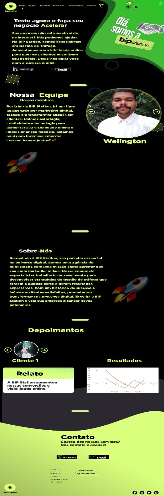

# BipStation

# 🚀 BiP Station – Plataforma de Impulsionamento Digital

Bem-vindo ao repositório do projeto **BiP Station**, uma aplicação web desenvolvida com o objetivo de potencializar a **visibilidade online de negócios** através da **gestão de tráfego pago**, **marketing de conteúdo** e **consultorias personalizadas**.

## 💡 Sobre o Projeto

A **BiP Station** é mais do que uma plataforma — é um **movimento digital**. Unimos **estratégia**, **criatividade** e **tecnologia** para transformar **cliques em clientes**. Aqui, oferecemos um ambiente intuitivo para empresas explorarem seus dados de campanha, otimizarem **funis de venda** e se conectarem com seu **público ideal**.

## 🖥️ Demonstração do Projeto



## 🛠️ Tecnologias Utilizadas

- **Python** – linguagem principal do backend
- **Flask** – microframework web utilizado para a API e renderização de páginas
- **HTML5** – estrutura das páginas
- **CSS3** – estilização da interface
- **JavaScript** – interatividade e comportamento dinâmico das páginas

## 📋 Funcionalidades

- **Gestão e visualização de campanhas de tráfego pago**
- **Relatórios semanais e mensais automatizados**
- **Segmentação de público com base em dados**
- **Consultoria e estudos de funil personalizados**
- **Geração de conteúdo estratégico com base em tendências**

## 🧠 Diferenciais da BiP Station

- **Atendimento humanizado e consultivo**
- **Estratégias focadas em conversão e crescimento real**
- **Transparência total** com **feedbacks semanais** e **relatórios mensais**
- Equipe **apaixonada por resultados e inovação**

## 📍 Navegação

O projeto está estruturado com rotas que permitem aos usuários acessar diferentes seções:

- **Início**
- **Equipe**
- **Metodologia**
- **Depoimentos**
- **Serviços**
- **Contato**

## 🏁 Como Rodar o Projeto

1. **Clone este repositório:**

2. **Crie um ambiente virtual e ative:**

   ```bash
   python -m venv venv
   source venv/bin/activate  # Linux/macOS
   venv\Scripts\activate     # Windows
   ```

3. **Instale as dependências:**

   ```bash
   pip install -r requirements.txt
   ```

4. **Execute o servidor Flask:**

   ```bash
   flask run
   ```

5. **Acesse** `http://127.0.0.1:5000` no seu navegador.

## 🤝 Contribuições

Instrutor: Celso Brunno Rocha Custódio
Thiago Monsuet da Silva - Scrum
André Luiz Lima Mendes - Analista Req
Antônio José Costa Nascimento - Front-End
Luiz Phelipe Soares de Araujo - Front-End
Henrique Martins Alves - Front-End
Mateus Martins Morais - Front-End
Gean Carlos Pitombeira da Silva – Front-End
Mychel Lucas - Front-End
Vitor Albuquerque de Souza- Front-End
Samuel Pereira Santos - Front-End
Marlon Dias Marques - Front-End
Gabriel Ludovico - Back-End
Vitor Bessa - Front-End
Hytallo - Front-End
João - Front-End


Contribuições são bem-vindas! Sinta-se à vontade para **abrir issues** ou **enviar pull requests**
